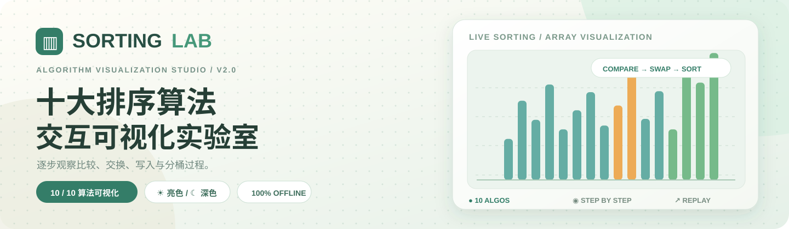
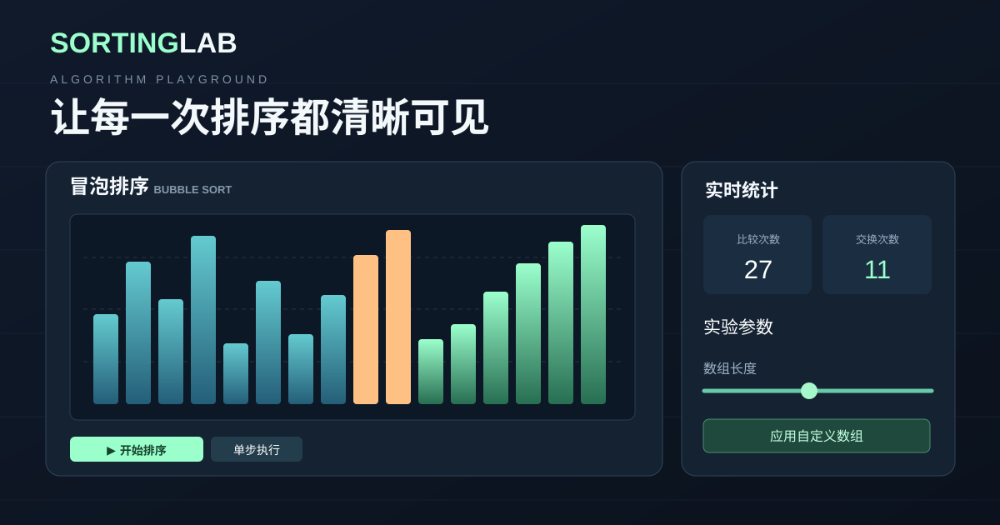
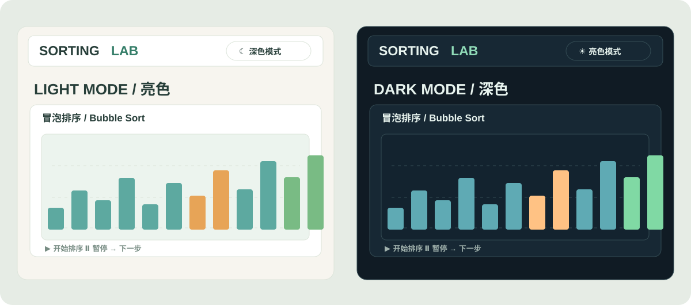
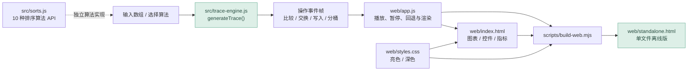

<div align="center">



# Sorting Lab · 十大经典排序算法交互可视化实验室

**让每一次比较、交换、写入与归并，都清晰可见。**

<p>
  
  
  
  
  
  <a href="LICENSE"></a>
</p>

[**📦 下载单文件离线版**](web/standalone.html) · [**🚀 快速运行**](#quick-start) · [**🧠 十种算法**](#algorithms) · [**🧪 测试与验证**](#testing) · [**📄 MIT 许可**](#license)

</div>

---

<a id="overview"></a>
## ✨ 项目简介

Sorting Lab 是一个专为**算法学习、课堂演示及交互式实验**设计的可视化工具，基于 **HTML + CSS + 原生 JavaScript** 实现，不需要前端框架、构建工具链或外部 CDN 才能使用生成的离线页面。

它既提供 **10 种排序算法的独立 API**，也为每一种算法提供**专属的操作事件追踪**。可视化并不是“切换名称但仍然播放冒泡动画”：比较排序会展示比较、交换和写入，计数／基数／桶排序会体现计数、分桶和重排过程。

| 📊 十算法完整可视化 | ⏯️ 自由探索执行步骤 | 🎨 亮色 / 深色主题 |
| :-- | :-- | :-- |
| 每种算法都有独立轨迹与操作说明 | 播放、暂停、继续、上一步、下一步、重置 | 默认亮色，一键切换；支持记忆选择 |

| 🔢 自定义实验数据 | 📈 实时复杂度与指标 | 📴 真正的单文件离线版 |
| :-- | :-- | :-- |
| 2–48 个整数；负数、重复值均支持 | 比较、交换、写入、轮次、进度及伪代码 | 下载 `web/standalone.html` 即可浏览器打开 |

<a id="preview"></a>
## 🧠 V2.2 教学可视化验收（已完成）

- **堆排序：** 独立 SVG 完整二叉树，真实父子连接、活动堆边界与节点交换数值动画；最多支持页面输入的 48 个节点，大树可在局部面板中水平滚动。
- **快速排序：** Pivot 数值、双指针 I/J、当前分区范围与主柱状图指针联动，分区外的元素弱化。
- **归并排序：** 左右缓冲区、读取位置、已读元素及当前回写目标随每帧更新，并区分区间局部有序与全局归位。
- **计数排序：** 动态频次直方图、被统计或回填的数字突出显示；常见整数跨度使用真正的稠密计数数组，过宽范围自动使用稀疏映射回退。
- **基数排序：** 逐位稳定分配到 0–9 号桶、突出当前桶，收集阶段与写回动作可逐帧观察。
- **桶排序：** 每个区间桶的动态内容，桶内部插入排序的比较、右移和插入都有真实轨迹，不再一瞬间完成桶内排序。
- **冒泡／选择／插入／希尔：** 增加比较边界、最小候选、插入键及 Gap 分组等算法专属说明。已确定归位的元素持续高亮；暂时有序的前缀或子区间使用另一种视觉标记，防止误导。
- **回归检查：** 独立算法轨迹、前进/后退、时序回放、离线与网页双入口、桌面和手机端的浏览器自动化测试。

> 本阶段仅完成 V2.2；**V3.0 的双算法左右同屏同步运行和实验结果导出尚未实现**。现有“双算法对照”仍只是静态统计表。

## 🚀 V3 工作台升级

在 V2 的十算法独立事件追踪基础上，V3 重点改进真正的交互体验：

- **紧凑导航：** 十算法横向选择，不再需要跨越大面积宣传区才能进入操作台。
- **可拖动时间轴：** 任意帧精确跳转、上一帧 / 下一帧、暂停 / 继续、事件类型反馈。
- **有符号柱状图：** 根据输入数据固定零基线，负数向下、正数向上；已归位区间持续高亮。
- **更连续的动画：** 保留可视化柱节点，交换事件增加位移动画，遵循系统降低动态效果设置。
- **专属算法辅助视图：** 快速排序显示枢轴和指针，归并显示双缓冲区，堆显示树形节点，计数／基数／桶显示对应统计与分桶。
- **双算法对照：** 使用同一组初始数据，对比完整事件轨迹的比较、交换、写入与轮次计数。此功能**不是实际耗时的性能基准测试**。
- **双主题与移动端：** 修正主色按钮的文本对比度，缩短首屏到图表的距离，并采用响应式布局。

> 使用建议：对桶排序和基数排序，优先观察右侧专属结构；对快速排序，关注 Pivot 与双指针；对归并排序，结合缓冲区与时间轴查看合并过程。

## 🖥️ 界面预览

<div align="center">
  
  <p><sub>上图为根据 V3 工作台布局制作的矢量示意图（非真实浏览器截图）。实际图表会响应交互实时变化。</sub></p>
</div>

<a id="themes"></a>
### 🎨 双主题：默认亮色，也能切回深色

<div align="center">
  
  <p><sub>主题配色示意。点击网页右上角的「☾ 深色模式 / ☀ 亮色模式」切换；支持本地存储时会保存偏好。</sub></p>
</div>

<a id="algorithms"></a>
## 🧠 十大经典排序算法

**全部具有独立的逐步可视化**，而不是只有算法函数：

| 编号 | 算法 | 平均时间复杂度 | 稳定性¹ | 动画观察重点 |
| :--: | :-- | :-- | :--: | :-- |
| 01 | **冒泡排序** Bubble Sort | `O(n²)` | ✅ | 相邻元素比较、交换、提前结束 |
| 02 | **选择排序** Selection Sort | `O(n²)` | ❌ | 扫描最小元素、轮次归位 |
| 03 | **插入排序** Insertion Sort | `O(n²)` | ✅ | 比较、右移、插入写回 |
| 04 | **希尔排序** Shell Sort | 取决于增量序列 | ❌ | 不同 gap 下的分组插入 |
| 05 | **归并排序** Merge Sort | `O(n log n)` | ✅ | 拆分、左右区间比较、归并写入 |
| 06 | **快速排序** Quick Sort | `O(n log n)` | ❌ | 枢轴、双指针扫描、分区交换 |
| 07 | **堆排序** Heap Sort | `O(n log n)` | ❌ | 建堆、父子比较、堆顶归位 |
| 08 | **计数排序** Counting Sort | `O(n + k)` | ✅¹ | 频次统计、按数值回填 |
| 09 | **基数排序** Radix Sort | `O(d(n + b))` | ✅¹ | 按位分桶、收集与符号处理 |
| 10 | **桶排序** Bucket Sort | 期望 `O(n + k)` | ✅¹ | 区间分桶、桶内排序、拼接 |

> ¹ 稳定性按经典算法的实现语义描述。当前实验室处理的是普通整数，无法仅凭相等整数判断具有不同身份的对象是否保持原始顺序。对于非比较排序，详细行为应以各自源码为准。表格是**经典算法主体的理论复杂度**，不包括教学轨迹记录的快照开销；可视化中采用的 `Map` 等辅助结构也可能带来额外操作成本。

<a id="interactions"></a>
## 🎮 如何交互

### 1. 选择算法并运行

点击页面上方的十个算法卡片即可切换。**切换算法时保留当前初始数组**，方便比较不同算法在同一输入上的表现。

| 操作 | 效果 |
| :-- | :-- |
| ▶ **开始 / 继续** | 以指定速度推进操作事件 |
| Ⅱ **暂停** | 停止自动播放，保留当前帧 |
| **← 上一步** | 回看上一次操作状态 |
| **下一步 →** | 一次只前进一帧 |
| ↻ **重置** | 回到该算法当前输入的初始帧 |
| **执行时间轴** | 拖动滑块跳转到任意帧，回看任意步骤 |
| **算法卡片** | 切换并重新生成该算法的追踪轨迹 |
| **双算法对照** | 在「双算法对照」标签页选择第二种算法，比较相同初始数组的事件统计 |

**配色图例：** 蓝绿色 = 常规元素；橙色 = 正在比较；珊瑚红 = 交换；紫色 = 写入或分桶；绿色 = 已确认排序区间。

### 2. 调整实验条件

- **数组长度：** 2–48 个元素，滑块调节。
- **运行速度：** 1×–5×，可在动画中修改。
- **数据分布：** 随机乱序、完全逆序、近乎有序、完全有序。
- **自定义输入：** 支持 2–48 个整数，每个数字范围 `-999` 到 `999`，允许负数、0 和重复值。

例如在「自定义整数数组」中输入：

```text
8, -3, 5, -3, 7, 0, 12
```

点击 **「应用自定义数组」** 后会载入数据，随后可以选择任意算法播放或单步执行。

### 3. 键盘快捷键

| 按键 | 作用 |
| :-- | :-- |
| `Space` | 播放 / 暂停 |
| `→` | 下一步 |
| `←` | 上一步 |

> 输入框、下拉选择框或按钮获得焦点时，不拦截这些键盘操作。页面提供移动端响应式布局，可使用屏幕上的控制按钮。完整状态记录由事件追踪器实现；比较不同算法的事件数量时，应注意其比较与写入口径不同。

<a id="quick-start"></a>
## 🚀 快速开始

### 方式 A · 下载单文件离线版（推荐）

**无需安装 Node.js，也无需联网。**

1. 打开 [`web/standalone.html`](web/standalone.html)。
2. 在 GitHub 文件页面点击 **Download raw file**，保存为 `standalone.html`。
3. 双击 HTML 文件，使用 Chrome、Edge 或 Firefox 打开。

> 注意：`web/standalone.html` 是已经内联 CSS 和 JavaScript 的可执行演示。请不要把 `web/index.html` 当成同样的单文件版本；后者依赖旁边的 CSS 和打包脚本。

### 方式 B · 使用 Node.js 本地开发

需要 **Node.js ≥ 20**：

```bash
git clone https://github.com/DearJIAN/classic-sorting-lab.git
cd classic-sorting-lab

# 启动内置本地服务器
npm run dev
```

在浏览器打开：**http://127.0.0.1:4173/**。

仓库无第三方运行依赖，正常使用无需 `npm install`。由于这是私有仓库，克隆前需完成 GitHub 身份验证。

### 方式 C · 修改代码后重新生成离线版

```bash
npm run build
```

构建由 `scripts/build-web.mjs` 执行，生成：

- `web/app.bundle.js` — 网页所需的浏览器脚本；
- `web/standalone.html` — 内联样式和脚本的单文件页面。

**请编辑 `src/` 与 `web/app.js`、`web/styles.css`、`web/index.html` 源文件，不要直接维护生成产物。**

<a id="architecture"></a>
## 🧩 工作原理与目录结构



```text
classic-sorting-lab/
├── README.md                        # 项目介绍及使用说明
├── docs/
│   ├── cover.svg                    # README 头图（亮色）
│   ├── preview.svg                  # V2 网页布局示意
│   └── themes.svg                   # 亮色 / 深色主题对比
├── src/
│   ├── sorts.js                     # 10 种排序算法的独立 API
│   ├── trace-engine.js              # 10 种算法各自的事件追踪器
│   └── bubble-machine.js            # 旧版冒泡逐比较状态机
├── web/
│   ├── index.html                   # 网页结构
│   ├── styles.css                   # 响应式 UI 与双主题
│   ├── app.js                       # 算法选择、事件回放、交互逻辑
│   ├── app.bundle.js                # 构建生成：浏览器脚本
│   └── standalone.html              # 构建生成：单文件离线演示
├── scripts/
│   ├── build-web.mjs                # 生成并核验网页产物
│   └── dev-server.mjs               # 无依赖的开发 HTTP 服务
├── tests/
│   ├── sorts.test.js                # 10 种算法的结果与输入约束测试
│   ├── trace-engine.test.js         # 逐帧排序轨迹与统计测试
│   ├── bubble-machine.test.js       # 冒泡状态机回归测试
│   ├── web-assets.test.js           # 网页资源与构建关联检查
│   └── browser_smoke.py             # Playwright 浏览器交互测试
└── .github/workflows/test.yml       # GitHub Actions 自动测试
```

**两个重要概念：**

- **排序结果 API**：`src/sorts.js` 使用纯函数风格，不改变调用者原数组，返回新的升序数组。
- **可视化 Trace API**：`src/trace-engine.js` 为教学记录中间状态，每一帧包含数组快照、活动下标、事件类型以及累计比较 / 交换 / 写入 / 轮次指标。它是为了回放与观察，不是性能基准测试器。

<a id="api"></a>
## 🧑‍💻 在代码中调用

### 直接排序

```js
import { algorithms, quickSort, mergeSort } from './src/sorts.js';

const values = [8, -3, 5, -3, 7];

console.log(quickSort(values));            // [-3, -3, 5, 7, 8]
console.log(mergeSort(values));            // [-3, -3, 5, 7, 8]
console.log(algorithms.heap.sort(values)); // [-3, -3, 5, 7, 8]
console.log(values);                       // 原数组未修改
```

### 生成算法执行轨迹

```js
import { catalog, generateTrace } from './src/trace-engine.js';

const frames = generateTrace([5, 2, 4, 1], 'bubble');

console.log(Object.keys(catalog));         // 10 种算法标识
console.log(frames[0]);                    // 初始状态
console.log(frames[1]);                    // 第一次操作后的状态
console.log(frames.at(-1).values);         // [1, 2, 4, 5]
```

`src/sorts.js` 与 `generateTrace()` 都校验输入是否为安全整数；页面自定义输入的 `-999～999` 范围属于额外的 UI 限制。

<a id="testing"></a>
## 🧪 测试与质量保障

### Node.js 单元测试

```bash
npm test
```

该命令会先执行 `pretest` 对生成资源做一致性检查，再运行 Node.js 内置测试框架覆盖的排序算法、状态机、追踪器及网页资源测试。

### Playwright 浏览器冒烟测试

```bash
python -m pip install playwright
python -m playwright install chromium
python tests/browser_smoke.py
```

浏览器测试覆盖正常打包页面与单文件离线页面，逐个切换十种算法，并验证自定义数据、单步、重置、亮暗主题切换、播放 / 暂停、时间轴跳转、负数零基线、对照面板、移动端及新数组生成。

### GitHub Actions

[](https://github.com/DearJIAN/classic-sorting-lab/actions/workflows/test.yml)

每次 `push` 或创建 Pull Request 后，工作流运行 Node.js 测试与 Chromium 浏览器测试。**徽章显示的是当前工作流真实状态**；有代码提交并不等于测试必然通过。

<a id="faq"></a>
## ❓ 常见问题

<details>
<summary><b>直接双击 web/index.html，为什么样式或交互可能不正常？</b></summary>

`index.html` 会加载相邻的 CSS 和 JavaScript 资源，直接从 `file://` 打开可能受浏览器限制。请使用 `npm run dev`，或直接打开为离线使用构建的 `web/standalone.html`。

</details>

<details>
<summary><b>为什么改变数组长度后排序会回到初始状态？</b></summary>

修改输入数据后，需要针对新的数组重新生成事件轨迹，因此会停止当前播放并从第一帧重新开始。

</details>

<details>
<summary><b>为什么相同算法的复杂度和实际动画帧数不是一回事？</b></summary>

复杂度描述算法的渐近运行成本；动画帧数取决于追踪器记录了哪些比较、交换、写入和阶段事件。此外，快照本身还会消耗额外的时间与内存。不要将教学动画帧数直接当成基准测试耗时。

</details>

<details>
<summary><b>为什么 GitHub 页面打不开，或者克隆失败？</b></summary>

本仓库当前为私有仓库，只有具备权限的账号才能访问。请确认浏览器或 Git 已通过具备访问权的 GitHub 账号认证。

</details>

<a id="license"></a>
## 📄 开源许可证 / License

本项目采用 **[MIT License](LICENSE)** 授权，版权声明为 **Copyright (c) 2026 DearJIAN**。

你可以在保留原始版权声明及许可证文本的前提下，使用、复制、修改、合并、发布、再许可及销售本项目代码（包括商业用途）。软件按“原样”提供，作者不提供任何明示或暗示的保证；完整法律条款请阅读仓库根目录的 [`LICENSE`](LICENSE)。

> **说明：** MIT 是代码使用许可，不会自动把 GitHub 私有仓库设为公开。当前仓库访问权限保持不变；私有仓库只有获得访问权限的人才能查看代码。

---

<div align="center">

**SORTING LAB — SEE EVERY STEP. UNDERSTAND EVERY SORT.**

<sub>Built with Vanilla JavaScript · Designed for curious minds · Documentation for V3</sub>

</div>
